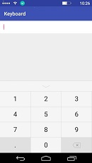

# Keyboard
###### 添加依赖

          allprojects {
               repositories {
            	    ...
                    maven { url 'https://jitpack.io' }
               }
           }
           
           
           

          dependencies {
	            implementation 'com.github.115MRLI:Keyboard:1.0.1'
	      }
	      
	      //小于AS 3.0 的版本  这么添加就好了
	      
	      dependencies {
          	        compile 'com.github.115MRLI:Keyboard:1.0.1'
          }

因为之前一直在做支付每次写一些自定义键盘都好麻烦，而且就算写好了下一个项目要用到也是要挪来挪去所以下狠心写了一歌依赖库、

写的不算太好。但是就目前来说还算满意

1）支付密码键盘

   调用方法
             
             //这个是自己在布局文件中创建的，输入框
             textAmount = (EditText) findViewById(R.id.textAmount);
            
                    // 设置不调用系统键盘
                    if (android.os.Build.VERSION.SDK_INT <= 10) {
                        textAmount.setInputType(InputType.TYPE_NULL);
                    } else {
                        this.getWindow().setSoftInputMode(
                                WindowManager.LayoutParams.SOFT_INPUT_STATE_ALWAYS_HIDDEN);
                        try {
                            Class<EditText> cls = EditText.class;
                            Method setShowSoftInputOnFocus;
                            setShowSoftInputOnFocus = cls.getMethod("setShowSoftInputOnFocus", boolean.class);
                            setShowSoftInputOnFocus.setAccessible(true);
                            setShowSoftInputOnFocus.invoke(textAmount, false);
                        } catch (Exception e) {
                            e.printStackTrace();
                        }
                    }
            
                    virtualKeyboardView = (VirtualKeyboardView) findViewById(R.id.virtualKeyboardView);
                    //设置输入框
                    virtualKeyboardView.setView(textAmount);
                    //点击输入框调起键盘
                    textAmount.setOnClickListener(new View.OnClickListener() {
                        @Override
                        public void onClick(View v) {
            
                            virtualKeyboardView.Opean();
                        }
                    });
                }
                

##### 展示

